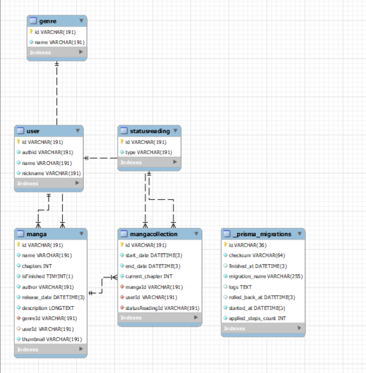
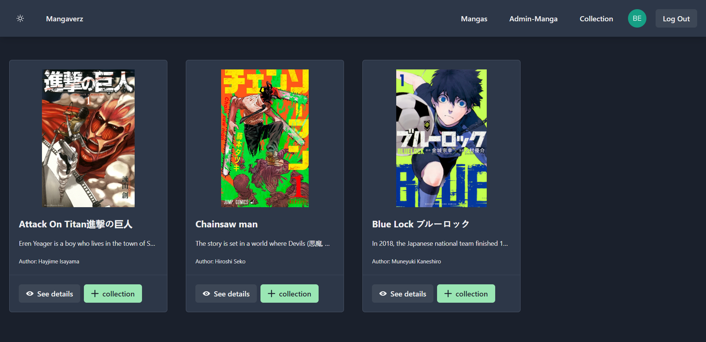
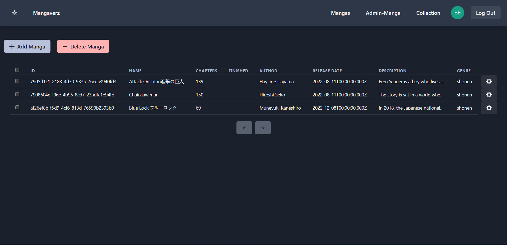
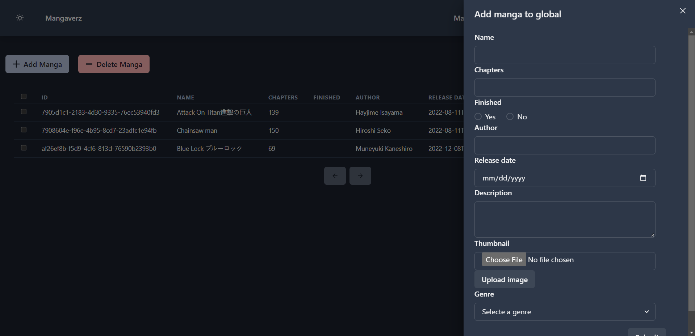
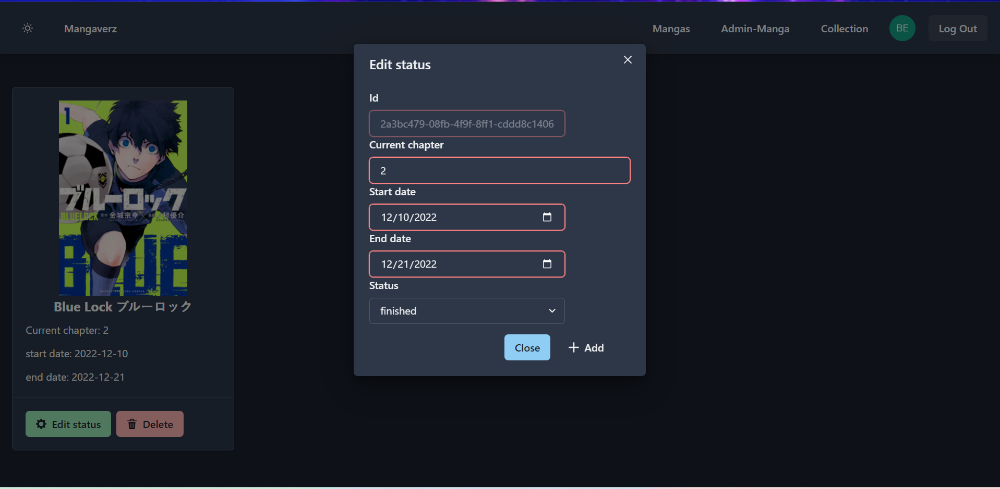
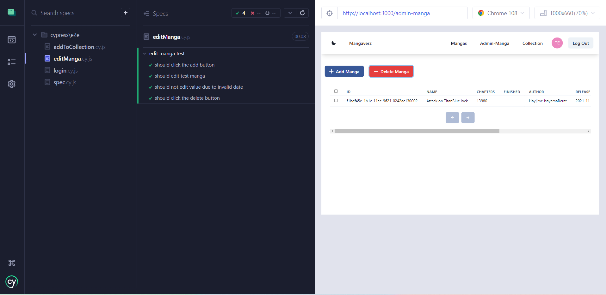
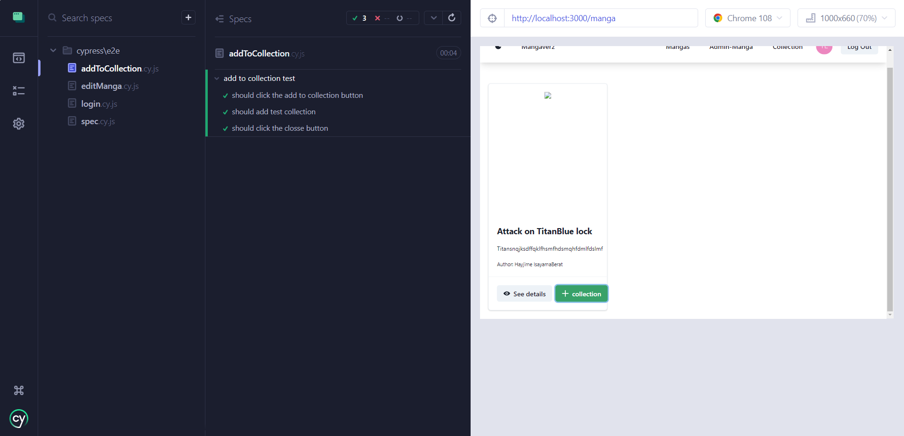
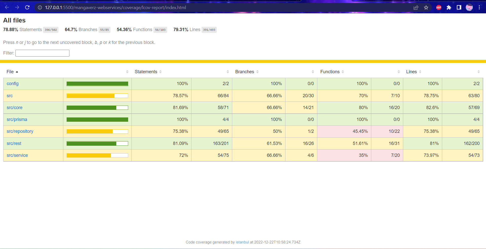
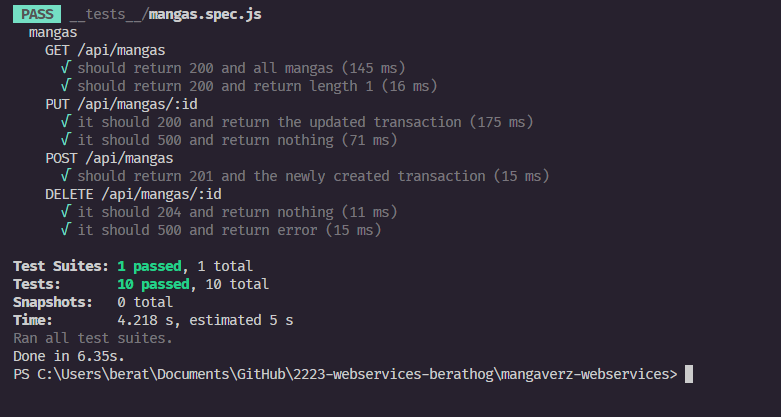

# Berat Kamali (202181265)

- [x] Front-end Web Development
  - [GitHub repository](https://github.com/Web-IV/2223-frontendweb-berathog)
  - [Online versie](https://frontendweb-mangaverz.onrender.com)
- [x] Web Services:
  - [GitHub repository](https://github.com/Web-IV/2223-webservices-berathog)
  - [Online versie](https://webservices-mangaverz.onrender.com)

**Logingegevens**

- Gebruikersnaam/e-mailadres: testuser@gmail.com
- Wachtwoord: Rootroot123

- Gebruikersnaam/e-mailadres: test123@gmail.com
- Wachtwoord: Rootroot123

## Projectbeschrijving

- **Genre**
  - id: unieke id van het genre
  - name: naam van het genre
- **User**
  - id: unieke id van een user
  - authid: id dat afkomstig is van auth0
  - name: email van een user
  - nickname: het gebruikersnaam is in dit geval uniek, omdat we op die manier de huidige user kunnen gebruiken binnen onze front-end
- **Manga**
  - id: unieke id van manga --> String
  - name: titel van een manga --> String
  - chapters: aantal hoofdstukken van een manga --> int
  - isFinished: toont aan of de reeks van een manga beëindigd  is --> Boolean
  - author: naam van de auteur --> String
  - release_date: datum wanneer de manga is uitgebracht (als we een manga toevoegen moet dit een datum zijn voor de huidige datum) -->Datetime
  - description: beschrijving van een manga --> String
  - genreID: id van een genre (inner join) --> id afkomstig van Genre tabel
  - userID: id van een user (inner join). Dit dient enkel wanneer een admin user iets toevoegd aan de globale collectie --> id afkomstig van User tabel
  - thumbnail: referentie naar Cloudinary om foto's op te halen --> String
- **Mangacollection**
  - id: unieke id van collection --> String
  - start_date: datum wanneer men is gestart met het lezen van een manga --> DateTime
  - end_date: datum wanneer men is gestopt met het lezen van een manga --> DateTime
  - current_chapter: het huidige hoofdstuk --> Int
  - mangaid: id van de manga dat zich bevindt binnen de collection
  - userid: id van de user die de manga heeft toegevoegd aan de collection
  - statusReadingId: status van het lezen (reading,paused,...)
- **Statusreading**
  - id: unieke id van de status -->String
  - type: naam van de status -->String

  

## Screenshots

## Behaalde minimumvereisten

### Front-end Web Development

- **componenten**

  - [x] heeft meerdere componenten - dom & slim (naast login/register)
  - [x] definieert constanten (variabelen, functies en componenten) buiten de component
  - [x] minstens één form met validatie (naast login/register)
  - [x] login systeem (eigen of extern zoals bv. Auth0)
 

- **routing**
  - [x] heeft minstens 2 pagina's (naast login/register)
  - [x] routes worden afgeschermd met authenticatie en autorisatie
 

- **state-management**

  - [x] meerdere API calls (naast login/register)
  - [x] degelijke foutmeldingen indien API call faalt
  - [x] gebruikt useState enkel voor lokale state
  - [x] gebruikt Context, useReducer, Redux… voor globale state
 

- **hooks**

  - [x] kent het verschil tussen de hooks (useCallback, useEffect…)
  - [x] gebruikt de hooks op de juiste manier
 

- **varia**
  - [x] een aantal niet-triviale testen (unit en/of e2e en/of ui)
  - [x] minstens één extra technologie
  - [x] duidelijke en volledige README.md
  - [x] volledig en tijdig ingediend dossier

### Web Services

- **datalaag**

  - [x] voldoende complex (meer dan één tabel)
  - [x] één module beheert de connectie + connectie wordt gesloten bij sluiten server
  - [x] heeft migraties
  - [x] heeft seeds
 

- **repositorylaag**

  - [x] definieert één repository per entiteit (niet voor tussentabellen) - indien van toepassing
  - [x] mapt OO-rijke data naar relationele tabellen en vice versa
 

- **servicelaag met een zekere complexiteit**

  - [x] bevat alle domeinlogica
  - [x] bevat geen SQL-queries of databank-gerelateerde code
 

- **REST-laag**

  - [x] meerdere routes met invoervalidatie
  - [x] degelijke foutboodschappen
  - [x] volgt de conventies van een RESTful API
  - [x] bevat geen domeinlogica
  - [] degelijke authorisatie/authenticatie op alle routes
 

- **varia**
  - [x] een aantal niet-triviale testen (min. 1 controller >=80% coverage)
  - [x] minstens één extra technologie
  - [x] duidelijke en volledige `README.md`
  - [x] maakt gebruik van de laatste ES6-features (object destructuring, spread operator...)
  - [x] volledig en tijdig ingediend dossier

## Projectstructuur

### Front-end Web Development

Het project bevat een map voor alle componenten. Dit is dan nogmaals onderverdeeld per categorie. We hebben ook een 'pages' folder. Hierin staan alle main 'pages' van de website. Deze componenten bevatten dan alle componenten van die pagina. De map 'topbard-crud' bevat de knoppen van het adminpaneel.

### Web Services

De mappen zijn onderverdeeld in verschillende lagen namelijk de repository laag (alle data afkomstig van de databank), services laag (toont foutboodschappen,...) en de rest laag (alle endpoints staan hier vermeld).

## Extra technologie

### Front-end Web Development
Als extra technologie heb ik ChakraUI gebruikt. Chakra UI is een eenvoudige, modulaire en toegankelijke component library die je de bouwstenen geeft die je nodig hebt om je React-toepassingen te bouwen. 
* [ChakraUI](https://chakra-ui.com/) 
* [ChakraUI NPM](https://www.npmjs.com/package/@chakra-ui/react)

### Web Services
Als extra technologie heb ik Prisma en Cloudinary gebruikt. Prisma is een open-source ORM voor Node.js en TypeScript. Het wordt gebruikt als een alternatief voor het schrijven van gewone SQL, of het gebruik van een andere database access tool zoals SQL query builders (zoals knex.js) of ORM's (zoals TypeORM en Sequelize). Cloudinary is een cloud omgeving om foto's op te slaan. Het is geen goed idee dat we een volledige image opslaan in een databank, daarom dat we enkel de referentie opslaan. 
* [Prisma](https://www.prisma.io/) 
* [Prisma NPM](https://www.npmjs.com/package/prisma)
* [Cloudinary Website](https://cloudinary.com/) 
* [Cloudinary NPM](https://www.npmjs.com/package/cloudinary-react)

## Testresultaten

### Front-end Web Development

Enkel de forms worden getest --> PUT en POST

### Web Services

Enkel het normaal en alternatief verloop van de manga endpoint wordt getest.

## Gekende bugs

### Front-end Web Development

isFinished: de boolean waarden verschijnen niet op het adminpaneel  
Form inputs: alle form inputs zijn rood (?)

### Web Services

